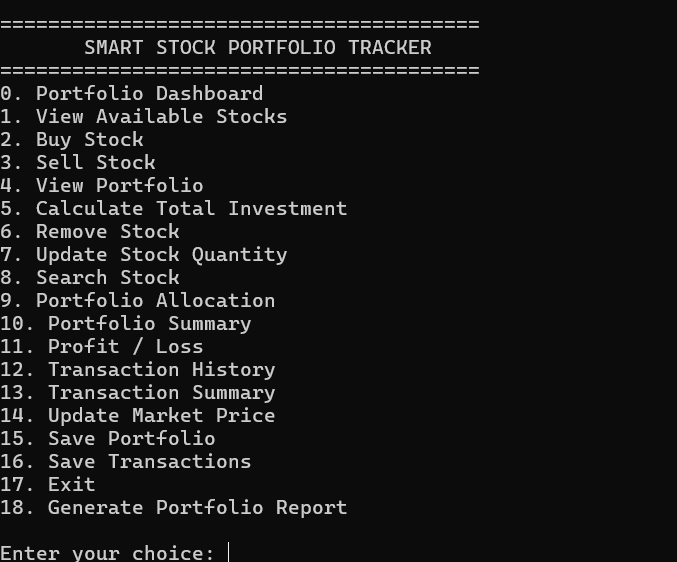
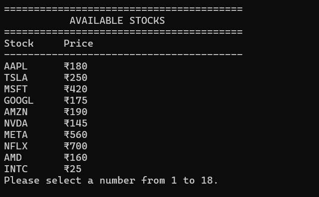
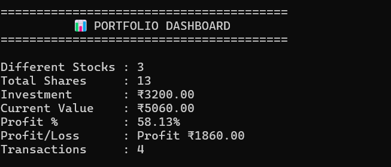
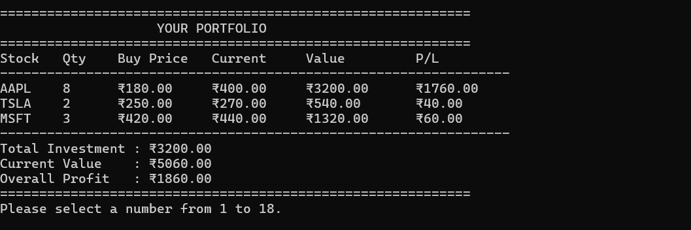
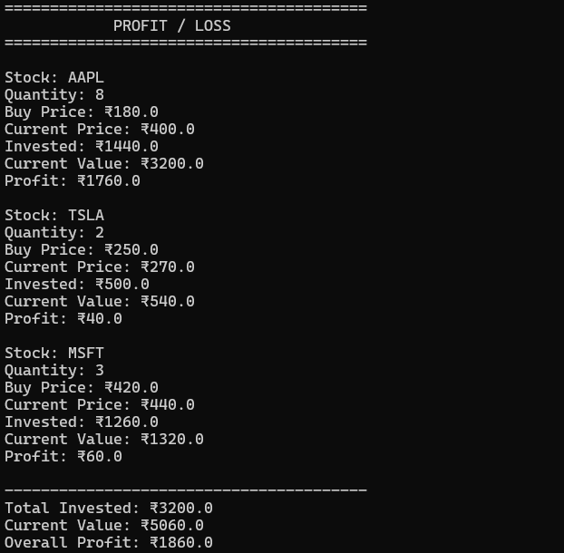
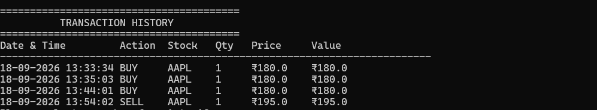
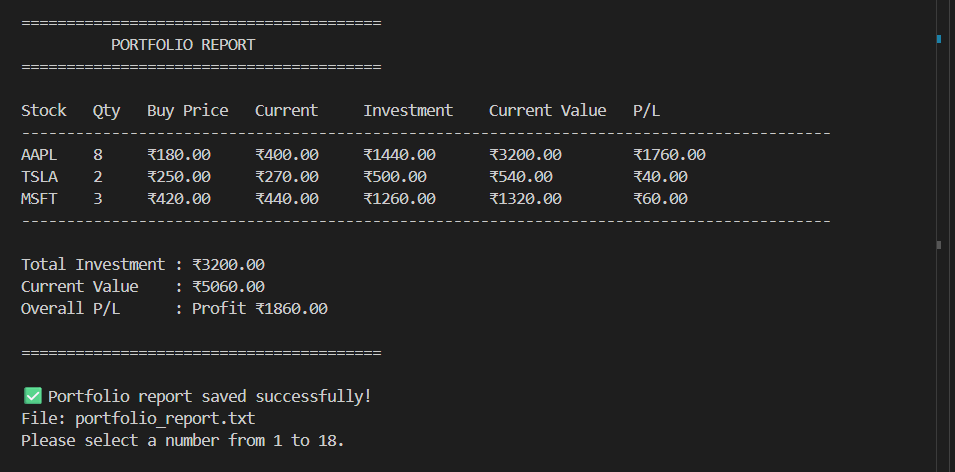

# Smart Stock Portfolio Tracker

A Python-based Smart Stock Portfolio Tracker developed as part of the CodeAlpha Internship.

## 📌 Project Overview

The Smart Stock Portfolio Tracker is a command-line Python application that allows users to manage their stock investments.

Users can:

- View available stocks
- Buy stocks
- Sell stocks
- View their portfolio
- Calculate total investment
- Update stock quantities
- Remove stocks
- Search for stocks
- View portfolio allocation
- View portfolio summary
- Calculate profit/loss
- View transaction history
- View transaction summary
- Update market prices
- Save portfolio data
- Save transaction data
- Generate a portfolio report

## 🚀 Features

### 1. View Available Stocks

Displays the predefined stocks and their prices.

Available stocks include:

- AAPL
- TSLA
- MSFT
- GOOGL
- AMZN
- NVDA
- META
- NFLX
- AMD
- INTC

### 2. Buy Stock

The user can enter:

- Stock symbol
- Quantity

The system calculates the investment automatically.

### 3. Sell Stock

Users can sell stocks from their portfolio.

The system checks the available quantity and calculates the realized profit or loss.

### 4. Portfolio Management

Users can:

- View portfolio
- Remove stocks
- Update stock quantity
- Search for stocks

### 5. Portfolio Dashboard

The dashboard provides a quick overview of:

- Number of stocks
- Total investment
- Current portfolio value
- Overall profit/loss

### 6. Portfolio Allocation

Displays how the total investment is distributed among different stocks.

### 7. Profit / Loss Calculation

The application compares the investment price with the current market price.

Formula:

```text
Profit/Loss = Current Value - Investment

## 📸 Screenshots

### 🖥️ Main Menu


### 📈 Available Stocks


### 📊 Portfolio Dashboard


### 💰 View Portfolio


### 📈 Profit / Loss


### 🔄 Transaction History


### 📄 Portfolio Report

